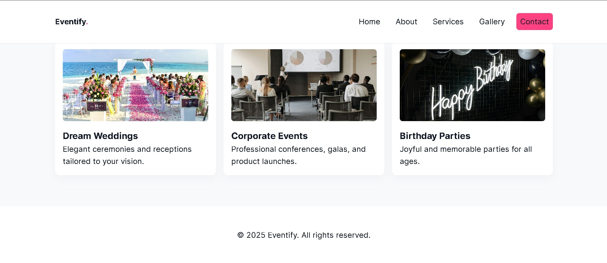
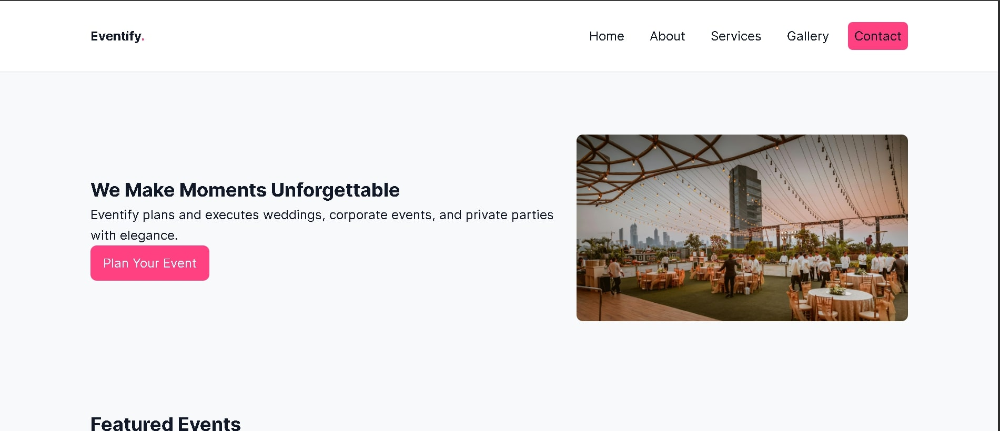
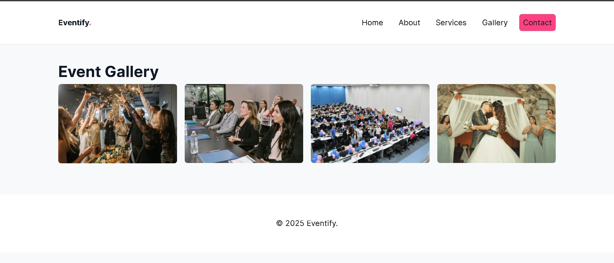

# 🎉 Eventify — Event Management Website

Eventify is a **multi-page responsive website** for an event management company.
It showcases services, team, event galleries, and provides a contact form for clients to book their events.

Built with **HTML5, CSS3, and JavaScript**, the site demonstrates best practices in structure, responsiveness, and interactivity.

## 🌐 Live Demo

👉 [View Deployed Site](#) _(replace with your GitHub Pages / Netlify / Vercel link)_

## 📂 Project Structure

```
plp-webtechnologies-classroom-july2025-july-2025-final-project-and-deployment-Final-Project-and-Depl/
├─ index.html        # Home page
├─ about.html        # About page
├─ services.html     # Services page
├─ gallery.html      # Gallery page
├─ contact.html      # Contact form page
├─ css/
│  └─ style.css      # Global styles
├─ js/
│  └─ main.js        # Interactivity scripts
├─ images/           # Placeholder images
└─ README.md         # Project documentation
```

## ✨ Features

- **Multi-page navigation** (Home, About, Services, Gallery, Contact)
- **Responsive design** for desktop, tablet, and mobile
- **Interactive elements**:

  - Mobile navigation toggle
  - Gallery lightbox viewer
  - Contact form validation with live feedback

- **Reusable layout** with consistent header & footer
- **Accessible markup** (semantic HTML, ARIA attributes)

## 🚀 Deployment

You can deploy Eventify for free using any static hosting service:

## 🛠️ Tech Stack

- **HTML5** → semantic structure
- **CSS3** → responsive design, layout, and animations
- **JavaScript (ES6)** → interactivity (menus, forms, lightbox)

1. **Fork the repo**
   Click the `Fork` button at the top of this repository to create your own copy.

2. **Clone your fork locally**

   ```bash
   git clone https://github.com/your-username/eventify.git
   cd eventify
   ```

3. **Create a new branch**

   ```bash
   git checkout -b feature/your-feature-name
   ```

4. **Make changes**

   - Edit HTML, CSS, or JS files as needed.
   - Add images to the `/images` folder if required.

5. **Commit changes**

   ```bash
   git add .
   git commit -m "Add feature: your feature description"
   ```

6. **Push to your fork**

   ```bash
   git push origin feature/your-feature-name
   ```

7. **Submit a Pull Request**

   - Go to the original repo on GitHub
   - Click **New Pull Request**
   - Provide a clear description of changes

---

## 📸 Screenshots

### Home Page




### Gallery



## 📑 License

This project is released under the **MIT License**.
Feel free to use, modify, and share it for learning or real-world projects.
